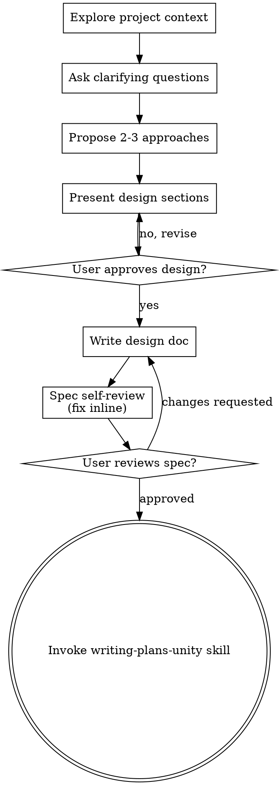

# Brainstorming Ideas Into Designs

Help turn ideas into fully formed designs and specs through natural collaborative dialogue.

Start by understanding the current project context, then ask questions one at a time to refine the idea. Once you understand what you're building, present the design and get user approval.

<HARD-GATE>
Do NOT invoke any implementation skill, write any code, scaffold any project, or take any implementation action until you have presented a design and the user has approved it. This applies to EVERY project regardless of perceived simplicity.
</HARD-GATE>

## Output Language Rules

Questions, design presentations, written spec prose, review notes, and handoff text MUST use the user's conversation language unless the user explicitly asks for another language.

Template labels and structural labels may stay in English. Labels such as `Goal`, `Scope`, `Architecture`, `Unity Surface`, `Verification`, `Issues Found`, and `Recommendations` are allowed. The explanatory body content after those labels must use the user's language.

If the user writes in Korean, write the spec's explanations, assumptions, design rationale, trade-offs, risks, verification rationale, reviewer notes, and handoff prose in natural Korean.

Keep exact technical identifiers unchanged:

- file paths, class names, method names, namespaces, package names, shader names, scene/prefab/asset names
- Unity API names such as `MonoBehaviour`, `ScriptableObject`, `Rigidbody`, `Animator`, `EditMode`, and `PlayMode`
- commands, code blocks, branch names, commit message examples, URLs, and quoted source text

When dispatching a spec reviewer, include the required prose language in the prompt. The reviewer must check body content language while allowing English template labels and exact technical identifiers.

## Unity Decision Axes

Ask one question at a time in the user's language. Do not ask every question mechanically; choose the next most important uncertainty and ask it alone.

Use these Unity axes to decide what to ask and what the design must settle:

- Genre/player fantasy/core loop
- Target platform/performance budget
- Input system and actor sources: player, AI, replay, network
- movement model: `CharacterController`, `Rigidbody`, NavMesh, custom kinematic, wheel physics, hybrid
- Camera model and rotation reference
- scene, prefab, and asset boundaries
- GameObject/component responsibility split
- Animation state, events, Animator parameters, and timing
- Physics, collision, trigger, layer, and query requirements
- UI technology: uGUI, UI Toolkit, world-space UI
- Data/save/inventory/stats/`ScriptableObject` tuning
- Package dependencies/render pipeline
- Multiplayer/networking
- Editor tooling/custom inspector
- verification surface: pure C#, EditMode, PlayMode, scene smoke, prefab smoke, Editor bridge

## Anti-Pattern: "This Is Too Simple To Need A Design"

Every project goes through this process. A todo list, a single-function utility, a config change: all of them. "Simple" projects are where unexamined assumptions cause the most wasted work. The design can be short (a few sentences for truly simple projects), but you MUST present it and get approval.

## Checklist

You MUST create a task for each of these items and complete them in order:

1. **Explore project context** - check files, docs, recent commits
2. **Ask clarifying questions** - one at a time, understand purpose/constraints/success criteria
3. **Propose 2-3 approaches** - with trade-offs and your recommendation
4. **Present design** - in sections scaled to their complexity, get user approval after each section
5. **Write design doc** - save to `docs/superpowers/specs/YYYY-MM-DD-<topic>-design.md` and commit
6. **Spec self-review** - quick inline check for placeholders, contradictions, ambiguity, scope (see below)
7. **User reviews written spec** - ask user to review the spec file before proceeding
8. **Transition to implementation** - invoke writing-plans-unity skill to create implementation plan

## Process Flow

**The terminal state is invoking writing-plans-unity.** Do NOT invoke frontend-design, mcp-builder, or any other implementation skill. The ONLY skill you invoke after brainstorming is writing-plans-unity.

## The Process

**Understanding the idea:**

- Check out the current project state first (files, docs, recent commits)
- Before asking detailed questions, assess scope: if the request describes multiple independent subsystems (e.g., "build a platform with chat, file storage, billing, and analytics"), flag this immediately. Don't spend questions refining details of a project that needs to be decomposed first.
- If the project is too large for a single spec, help the user decompose into sub-projects: what are the independent pieces, how do they relate, what order should they be built? Then brainstorm the first sub-project through the normal design flow. Each sub-project gets its own spec -> plan -> implementation cycle.
- For appropriately-scoped projects, ask questions one at a time to refine the idea
- Prefer multiple choice questions when possible, but open-ended is fine too
- Only one question per message - if a topic needs more exploration, break it into multiple questions
- Focus on understanding: purpose, constraints, success criteria

**Exploring approaches:**

- Propose 2-3 different approaches with trade-offs
- Present options conversationally with your recommendation and reasoning
- Lead with your recommended option and explain why

**Unity architecture pressure checks:**

- If behavior differs by mode, use `State` and an explicit transition rule.
- If calculation or policy varies by actor, input, camera, vehicle, or access rule, use `Strategy`.
- If a capability is optional, prefer a small interface over broad inheritance.
- If only some implementers need a capability, add a new interface instead of expanding an existing interface.
- If data should be designer-tunable, use `ScriptableObject`.
- If scene or prefab wiring is required, include it in the design.
- If Editor bridge verification is possible, design for fresh evidence.

**Presenting the design:**

- Once you believe you understand what you're building, present the design
- Scale each section to its complexity: a few sentences if straightforward, up to 200-300 words if nuanced
- Ask after each section whether it looks right so far
- Cover: architecture, components, data flow, scene/prefab/asset wiring, GameObject/component ownership, data or `ScriptableObject` configuration, error handling, testing, and verification
- For Unity designs, explicitly name the expected scene objects, prefab or asset changes, serialized references, package/render-pipeline assumptions, and verification surface: pure C#, EditMode, PlayMode, scene smoke, prefab smoke, or Editor bridge
- Be ready to go back and clarify if something doesn't make sense

**Design for isolation and clarity:**

- Break the system into smaller units that each have one clear purpose, communicate through well-defined interfaces, and can be understood and tested independently
- For each unit, you should be able to answer: what does it do, how do you use it, and what does it depend on?
- Can someone understand what a unit does without reading its internals? Can you change the internals without breaking consumers? If not, the boundaries need work.
- Smaller, well-bounded units are also easier for you to work with - you reason better about code you can hold in context at once, and your edits are more reliable when files are focused. When a file grows large, that's often a signal that it's doing too much.

**Working in existing codebases:**

- Explore the current structure before proposing changes. Follow existing patterns.
- Where existing code has problems that affect the work (e.g., a file that's grown too large, unclear boundaries, tangled responsibilities), include targeted improvements as part of the design - the way a good developer improves code they're working in.
- Don't propose unrelated refactoring. Stay focused on what serves the current goal.

## After the Design

**Documentation:**

- Write the validated design (spec) to `docs/superpowers/specs/YYYY-MM-DD-<topic>-design.md`
  - (User preferences for spec location override this default)
- Write explanatory spec body content according to Output Language Rules. English section labels are allowed; the body under them must use the user's conversation language.
- Use elements-of-style:writing-clearly-and-concisely skill if available
- Commit the design document to git

**Spec Self-Review:**
After writing the spec document, look at it with fresh eyes:

1. **Placeholder scan:** Any "TBD", "TODO", incomplete sections, or vague requirements? Fix them.
2. **Internal consistency:** Do any sections contradict each other? Does the architecture match the feature descriptions?
3. **Scope check:** Is this focused enough for a single implementation plan, or does it need decomposition?
4. **Ambiguity check:** Could any requirement be interpreted two different ways? If so, pick one and make it explicit.

Fix any issues inline. No need to re-review; just fix and move on.

**User Review Gate:**
After the spec review loop passes, ask the user to review the written spec before proceeding:

> "Spec written and committed to `<path>`. Please review it. If there are no changes, should I create the implementation plan with writing-plans-unity?"

The quote above is a structure example. In actual handoff text, use the user's conversation language while keeping the path unchanged. The handoff MUST explicitly ask whether to proceed to `writing-plans-unity`.

Wait for the user's response. If they request changes, make them and re-run the spec review loop. Only proceed once the user approves.

**Implementation:**

- Invoke the writing-plans-unity skill to create a detailed implementation plan
- Do NOT invoke any other skill. writing-plans-unity is the next step.

## Key Principles

- **One question at a time** - Don't overwhelm with multiple questions
- **Multiple choice preferred** - Easier to answer than open-ended when possible
- **YAGNI ruthlessly** - Remove unnecessary features from all designs
- **Explore alternatives** - Always propose 2-3 approaches before settling
- **Incremental validation** - Present design, get approval before moving on
- **Be flexible** - Go back and clarify when something doesn't make sense
