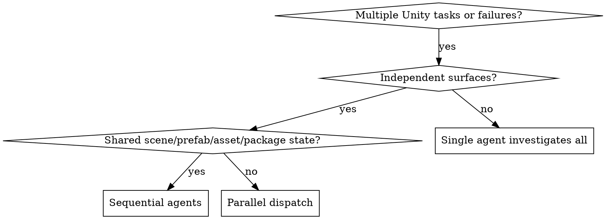

# Dispatching Parallel Agents

## Overview

You delegate independent Unity problem domains to specialized agents with isolated context. Each agent gets the exact files, Unity surfaces, verification command, and expected return format it needs.

**Core principle:** Dispatch one agent per independent Unity surface. Do not parallelize shared serialized state.

## Unity Parallelism Rule

Parallelize only independent Unity surfaces:

- Safe in parallel: pure C# runtime code in disjoint files, editor tooling in disjoint files, docs, tests that do not share fixtures, validation scripts.
- Usually sequential: `.unity`, `.prefab`, `.asset`, `.meta`, `Packages/manifest.json`, `Packages/packages-lock.json`, `ProjectSettings/`, asmdefs, Animator controllers, input actions.
- Integration tasks that wire scene/prefab/asset references should run after code tasks are reviewed.

If two agents may touch the same Unity asset or serialized reference graph, do not dispatch them in parallel.

## When to Use



**Use when:**
- One agent can fix pure C# movement math while another updates UI Toolkit USS.
- One agent can inspect an EditMode test failure while another investigates package documentation.
- Multiple compile errors are in unrelated asmdefs or disjoint scripts.
- Documentation, validation scripts, and source analysis can run without touching Unity serialized assets.

**Do not use when:**
- Tasks share a scene, prefab, ScriptableObject, `.meta`, package manifest, ProjectSettings, input actions, or Animator controller.
- One task's result decides another task's design.
- You need one coherent root-cause investigation.

## The Pattern

### 1. Identify Independent Domains

Group by Unity ownership:

- Domain A: `Assets/Scripts/Movement/` pure C# and EditMode tests.
- Domain B: `Assets/Scripts/UI/` UI Toolkit controller and USS.
- Domain C: docs or source analysis.

Do not group by "easy vs hard"; group by ownership and conflict risk.

### 2. Create Focused Agent Tasks

Each agent gets:

- **Specific scope:** exact files, folders, tests, scenes, prefabs, or assets.
- **Clear goal:** the behavior or failure to resolve.
- **Constraints:** files and Unity surfaces it must not touch.
- **Evidence:** exact EditMode, PlayMode, console, scene smoke, prefab smoke, or bridge-specific evidence.
- **Expected output:** root cause, changes, evidence, files touched, concerns.

### 3. Dispatch in Parallel

Example parallel-safe dispatch:

```text
Agent 1: Fix `Assets/Tests/EditMode/Movement/MovementMathTests.cs` and `Assets/Scripts/Movement/MovementMath.cs`.
Agent 2: Review `Assets/Scripts/UI/HudPresenter.cs` and `Assets/UI/Hud.uxml` for binding mismatch. Do not edit scenes or prefabs.
Agent 3: Search `docs/solutions/` for prior Input System setup failures and summarize relevant guidance.
```

### 4. Review and Integrate

When agents return:

- Read each summary and touched-file list.
- Check for conflicts in code and serialized Unity assets.
- Run combined verification: compile/domain reload, console, relevant EditMode/PlayMode tests, scene/prefab smoke where affected.
- Integrate sequentially if any scene, prefab, package, ProjectSettings, or `.meta` change appears.

## Agent Prompt Structure

Good Unity parallel-agent prompts are:

1. **Focused** - one clear problem domain.
2. **Self-contained** - all context needed to understand the task.
3. **Explicit about forbidden surfaces** - name what not to touch.
4. **Evidence-driven** - specify exactly what proof to gather.

```markdown
Investigate the failing EditMode tests in `Assets/Tests/EditMode/Movement/MovementMathTests.cs`.

Scope:
- You may edit `Assets/Scripts/Movement/MovementMath.cs`
- You may edit `Assets/Tests/EditMode/Movement/MovementMathTests.cs`
- Do not edit scenes, prefabs, ScriptableObjects, packages, ProjectSettings, or `.meta` files

Goal:
- Find whether the failure is a test expectation issue or movement math bug
- Fix the root cause only
- Verify with the targeted EditMode test

Return:
- Root cause
- Files changed
- Test command and result
- Any task constraints or selected bridge evidence gaps
```

## Common Mistakes

**Too broad:** "Fix all Unity test failures" - agent gets lost.
**Specific:** "Fix `MovementMathTests` only; do not touch scenes or prefabs."

**No Unity surface constraints:** Agent may edit a prefab while another agent edits the same prefab.
**Good constraints:** "Do not edit `.unity`, `.prefab`, `.asset`, `.meta`, `Packages/`, or `ProjectSettings/`."

**Vague evidence:** "Verify it works."
**Specific evidence:** "Run the targeted EditMode test and read the Unity console after refresh."

## When NOT to Use

- Related failures where one scene/prefab wiring error may explain everything.
- Shared Unity serialized assets.
- Package or ProjectSettings changes.
- Exploratory debugging where root cause is unknown and may cross layers.
- Runtime behavior requiring one active Unity Editor state.

## Real Unity Example

**Scenario:** 5 failures after adding player interaction:

- `InteractionRangeTests`: pure C# range math failed.
- `HudBindingTests`: UI Toolkit binding path failed.
- `PlayerInteractionPlayModeTests`: scene wiring missing.

**Decision:**

- Dispatch range math and HUD binding in parallel.
- Keep PlayMode scene wiring sequential after both code tasks return.

**Dispatch:**

```text
Agent 1 -> Fix range math tests only
Agent 2 -> Fix HUD binding tests only
Agent 3 -> Search docs/solutions for Input System interaction lessons
```

**Sequential integration:**

```text
Controller -> Wire scene/prefab references after Agent 1 and Agent 2 pass review
Controller -> Run PlayMode scene smoke and console check
```

## Verification

After agents return:

1. Review each summary and touched-file list.
2. Confirm no conflicting Unity serialized asset edits.
3. Run combined tests and Unity console check.
4. Inspect affected scenes, prefabs, assets, packages, and `.meta` files if any changed.

## Real-World Impact

Parallel agents are useful for Unity only when ownership is explicit. Without ownership boundaries, the speed gain is lost to scene, prefab, asset, and `.meta` conflicts.
