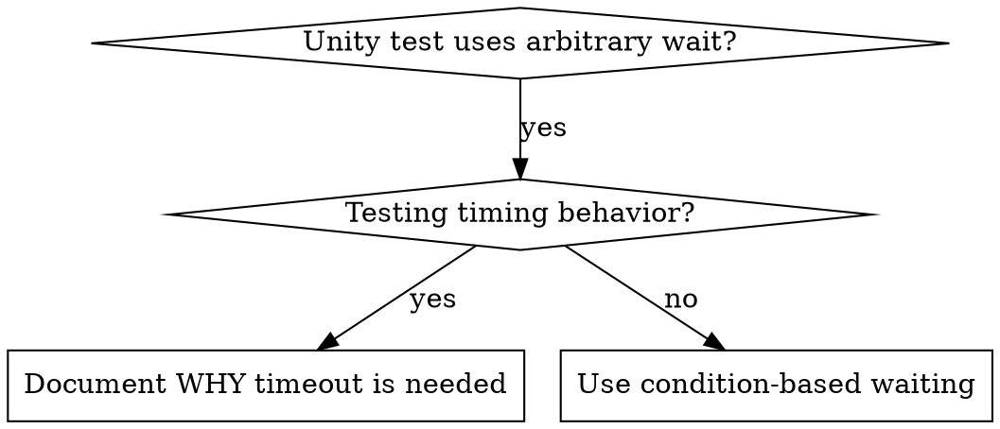

# Condition-Based Waiting

## Overview

Flaky Unity tests often guess at timing with `WaitForSeconds`, fixed frame counts, or external sleeps. This creates race conditions where tests pass locally but fail under load, in CI, or after minor frame-rate changes.

**Core principle:** Wait for the Unity condition you care about, not a guess about how long it takes.

## When to Use



**Use when:**
- Tests have arbitrary waits (`WaitForSeconds`, polling sleeps, fixed frame counts)
- Tests are flaky
- Tests timeout when run in parallel
- Waiting for scene loading, physics settling, animation states, object spawning, addressable loads, or async operations

**Don't use when:**
- Testing actual timing behavior such as invulnerability windows, cooldowns, transition durations, debounce, or throttle intervals
- A fixed wait is tied to a designed duration and documented

## Core Pattern

```csharp
// BAD: Guessing at frame timing.
yield return new WaitForSeconds(0.2f);
Assert.IsTrue(playerMotor.IsGrounded);

// GOOD: Waiting for the actual condition.
yield return UnityConditionWait.UntilFixed(
    () => playerMotor.IsGrounded,
    "player to become grounded after spawn");
Assert.IsTrue(playerMotor.IsGrounded);
```

## Quick Patterns

| Scenario | Pattern |
|----------|---------|
| Wait for scene object | `yield return UnityConditionWait.UntilObjectExists("Player")` |
| Wait for physics state | `yield return UnityConditionWait.UntilFixed(() => motor.IsGrounded, "player grounded")` |
| Wait for animation | `yield return UnityConditionWait.UntilAnimatorState(animator, "JumpLand")` |
| Wait for component state | `yield return UnityConditionWait.Until(() => health.Current <= 0, "enemy death")` |
| Wait for async operation | `yield return UnityConditionWait.Until(() => operation.isDone, "asset load")` |

## Implementation

Generic UnityTest polling function:

```csharp
public static IEnumerator Until(
    Func<bool> condition,
    string description,
    float timeoutSeconds = 5f)
{
    var start = Time.realtimeSinceStartup;

    while (!condition())
    {
        if (Time.realtimeSinceStartup - start > timeoutSeconds)
        {
            Assert.Fail($"Timeout waiting for {description}");
        }

        yield return null;
    }
}
```

For physics conditions in PlayMode tests, yield fixed physics steps:

```csharp
public static IEnumerator UntilFixed(
    Func<bool> condition,
    string description,
    float timeoutSeconds = 5f)
{
    var start = Time.realtimeSinceStartup;

    while (!condition())
    {
        if (Time.realtimeSinceStartup - start > timeoutSeconds)
        {
            Assert.Fail($"Timeout waiting for {description}");
        }

        yield return new WaitForFixedUpdate();
    }
}
```

Use `GameObject.Find` helpers only for smoke tests. Prefer direct references, serialized references, or explicit scene queries when possible.

See `condition-based-waiting-example.cs` in this directory for Unity helpers and a `[UnityTest]` example.

## Common Mistakes

**BAD: Tight polling:** `while (!done) { }` freezes the runner.
**Fix:** Yield each frame or use a justified interval.

**BAD: No timeout:** Coroutine loops forever when the condition never happens.
**Fix:** Always include a timeout with a clear error.

**BAD: Stale data:** Cache component state before the loop.
**Fix:** Read the current state inside the condition.

**BAD: Editor/runtime mismatch:** EditMode proof is used for physics or animation behavior.
**Fix:** Use PlayMode tests or a runtime smoke test when engine timing matters.

**BAD: Name-only lookup:** `GameObject.Find("Player")` silently misses inactive objects and breaks when names change.
**Fix:** Use direct references or serialized scene/prefab evidence unless the test is intentionally a broad smoke test.

## When Arbitrary Timeout IS Correct

```csharp
// Animator transition has a designed 0.15s exit time.
yield return UnityConditionWait.UntilAnimatorState(animator, "AttackStart");
yield return new WaitForSeconds(0.2f);
Assert.IsTrue(animator.GetCurrentAnimatorStateInfo(0).IsName("AttackRecover"));
```

**Requirements:**
1. First wait for the triggering condition.
2. Base the duration on known Unity behavior or authored content.
3. Add a comment explaining why the fixed wait exists.

## Real-World Impact

From Unity debugging sessions:
- Flaky PlayMode tests become tied to scene state instead of frame-rate guesses
- Failures report the missing Unity condition directly
- Runtime smoke tests stop depending on local machine speed
