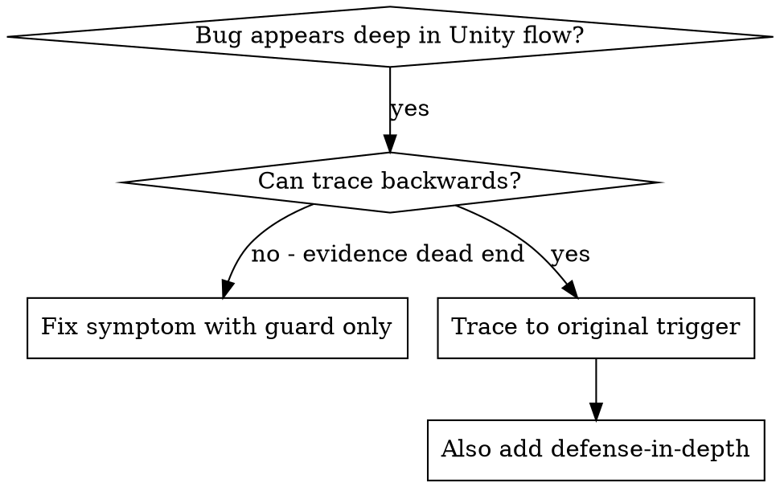
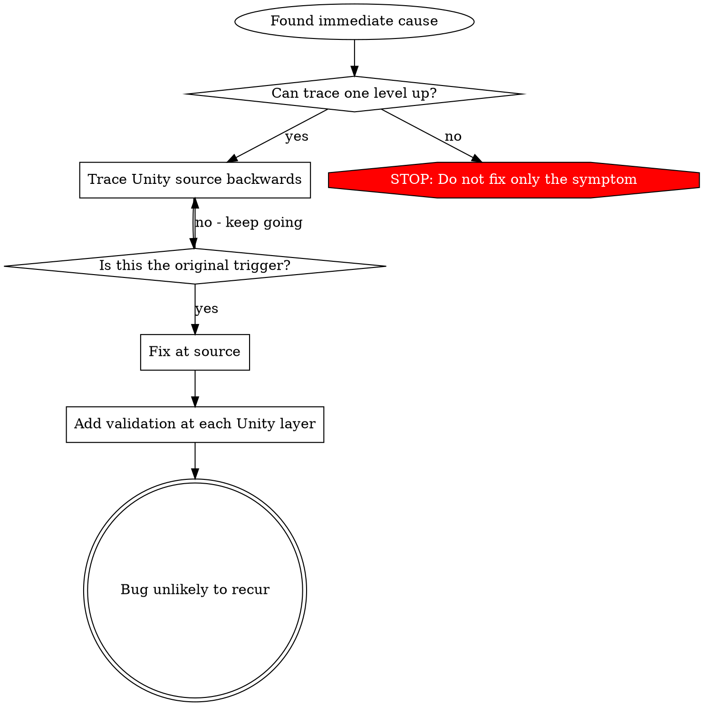

# Root Cause Tracing

## Overview

Bugs often appear deep in Unity runtime code: a `NullReferenceException` in a controller, a prefab with missing serialized references, an asset generated in the wrong project, or MCPForUnity operating against a stale Editor instance. Fixing where the error appears treats the symptom.

**Core principle:** Trace backward through the scene, prefab, asset, call chain, and tool target until you find the original trigger, then fix at the source.

## When to Use



**Use when:**
- Error happens deep in a MonoBehaviour, system, animation, prefab, or tool operation
- Stack trace shows a long call chain
- A serialized reference, generated asset, or MCP target is wrong
- Need to find which Unity test or scene setup creates unwanted state

## The Tracing Process

### 1. Observe the Symptom

```text
NullReferenceException: PlayerAttackController.PerformAttack()
weaponConfig is null
```

### 2. Find Immediate Cause

**What code directly causes this?**

```csharp
damageCalculator.Calculate(weaponConfig.BaseDamage, target.Armor);
```

### 3. Ask: What Called This?

```text
PlayerAttackController.PerformAttack()
<- PlayerInputRouter.FirePressed()
<- PlayerRuntimeInstaller wires input to controller
<- Scene uses Player_Combat.prefab
```

### 4. Keep Tracing Up

**What value was passed?**
- `weaponConfig = null`
- `Player_Combat.prefab` has an empty serialized `weaponConfig` field
- Base `Player.prefab` has the correct reference
- Variant override removed the reference

### 5. Find Original Trigger

**Where did the bad state originate?**

```text
Recent refactor moved weapon data from PlayerStats to WeaponConfig.
Base prefab was updated.
Combat prefab variant was not inspected after the serialized field move.
```

## Adding Unity Evidence

When manual tracing stalls, add temporary instrumentation near the failing operation. This is evidence-gathering code, not the fix. Remove it after tracing; do not commit broad guards that silently hide the failure.

```csharp
// Temporary tracing only. Remove after diagnosis.
private void PerformAttack()
{
#if UNITY_EDITOR
    var prefabLinked = UnityEditor.PrefabUtility.IsPartOfPrefabInstance(gameObject);
#else
    var prefabLinked = false;
#endif

    Debug.LogError(
        $"DEBUG attack source={name} scene={gameObject.scene.path} " +
        $"prefabLinked={prefabLinked} " +
        $"weaponConfig={(weaponConfig == null ? "null" : weaponConfig.name)}",
        this);

    if (weaponConfig == null)
    {
        throw new System.InvalidOperationException("Missing WeaponConfig; trace prefab, variant, scene, and installer wiring.");
    }

    damageCalculator.Calculate(weaponConfig.BaseDamage, target.Armor);
}
```

For runtime-only code, use `Debug.LogError(..., this)` so the console links back to the object. `UnityEditor.PrefabUtility` is Editor-only evidence; it is valid in Editor/PlayMode-in-Editor tracing, not in player builds.

Run targeted tests:

```bash
Unity.exe -batchmode -projectPath . -runTests -testPlatform PlayMode -testFilter PlayerAttackTests -testResults TestResults.xml -quit
```

If using MCPForUnity, verify the tool target before trusting tool output:

```text
MCP target identity
Application.dataPath
active scene path
selected prefab or asset path
```

## Finding Which Unity Test Causes Pollution

If an asset, scene object, or generated file appears during tests but you do not know which test created it:

```bash
./find-polluter.sh 'Assets/Generated/Debug.asset' test-names.txt "$UNITY_EDITOR" . EditMode
```

`test-names.txt` should contain one fully-qualified Unity test name per line.

## Real Example: Missing Prefab Variant Reference

**Symptom:** attack works in one scene but fails in PlayMode tests.

**Trace chain:**
1. `PerformAttack()` dereferences `weaponConfig`
2. `PlayerAttackController` on runtime object has null field
3. Runtime object came from `Player_Combat.prefab`
4. `Player_Combat.prefab` is a variant of `Player.prefab`
5. Variant override preserved an empty field after a serialized field migration

**Root cause:** prefab variant not re-wired after data moved into `WeaponConfig`.

**Fix:** repair the variant reference and add an EditMode prefab validation test.

**Also add defense-in-depth:**
- Layer 1: `OnValidate` warns when required config is missing
- Layer 2: prefab validation test scans shipped player prefabs
- Layer 3: PlayMode smoke test attacks once in the representative combat scene
- Layer 4: MCP/editor verification records active scene and prefab path before completion

## Key Principle



**Do not fix only where the error appears.** Trace back to the scene, prefab, asset, serialized data, command, or MCP target that introduced it.
