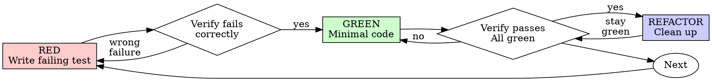

# Test-Driven Development (TDD)

## Overview

Write the test first. Watch it fail. Write minimal code to pass.

**Core principle:** If you didn't watch the test fail, you don't know if it tests the right thing.

**Violating the letter of the rules is violating the spirit of the rules.**

## Unity Test Choice

Pick the narrowest meaningful failing evidence before implementation:

- pure C# test for deterministic domain logic
- EditMode test for Unity API, components, assets, or serialization
- PlayMode test for runtime behavior, physics, animation timing, input flow, scene startup, or coroutine behavior
- prefab smoke for serialized component wiring
- scene smoke for hierarchy, camera, lighting, object placement, or runtime composition
- manual evidence only when Unity automation cannot observe the behavior, with the reason stated before implementation

For Unity architecture, prefer tests at the lowest stable boundary:

- Pure C# for math, transition rules, strategy decisions, and data transforms.
- EditMode for `ScriptableObject` defaults, serialized component validation, editor utilities, and prefab asset checks.
- PlayMode for physics, animation, coroutines, Input System flow, lifecycle ordering, and scene startup.

If implementation code was written before the failing evidence and an automated test is feasible, delete or isolate that implementation and restart from the failing evidence.

## When to Use

**Always:**
- New features
- Bug fixes
- Refactoring
- Behavior changes

**Exceptions (ask your human partner):**
- Throwaway prototypes
- Generated code
- Configuration files

Thinking "skip TDD just this once"? Stop. That's rationalization.

## The Iron Law

```
NO PRODUCTION CODE WITHOUT A FAILING TEST FIRST
```

Write code before the test? Delete it. Start over.

**No exceptions:**
- Don't keep it as "reference"
- Don't "adapt" it while writing tests
- Don't look at it
- Delete means delete

Implement fresh from tests. Period.

## Red-Green-Refactor



### RED - Write Failing Test

Write one minimal test showing what should happen.

**Good:**

```csharp
using NUnit.Framework;
using UnityEngine;

public sealed class MovementMathTests
{
    [Test]
    public void ClampVelocity_LimitsMagnitudeToMaxSpeed()
    {
        var velocity = new Vector3(10f, 0f, 0f);

        var result = MovementMath.ClampVelocity(velocity, maxSpeed: 4f);

        Assert.That(result.magnitude, Is.EqualTo(4f).Within(0.001f));
    }
}
```

Clear name, tests real behavior, one thing

**Bad:**

```csharp
[Test]
public void Movement_Works()
{
    var velocity = Vector3.right;

    Assert.That(velocity, Is.Not.EqualTo(Vector3.zero));
}
```

Vague name, only proves test setup

**Requirements:**
- One behavior
- Clear name
- Real code (no mocks unless unavoidable)

### Verify RED - Watch It Fail

**MANDATORY. Never skip.**

```text
run_tests(EditMode, test_names: MovementMathTests.ClampVelocity_LimitsMagnitudeToMaxSpeed)
```

Confirm:
- Test fails (not errors)
- Failure message is expected
- Fails because feature missing (not typos)

**Test passes?** You're testing existing behavior. Fix test.

**Test errors?** Fix error, re-run until it fails correctly.

### GREEN - Minimal Code

Write simplest code to pass the test.

**Good:**

```csharp
using UnityEngine;

public static class MovementMath
{
    public static Vector3 ClampVelocity(Vector3 velocity, float maxSpeed)
    {
        return Vector3.ClampMagnitude(velocity, maxSpeed);
    }
}
```

Just enough to pass

**Bad:**

```csharp
using UnityEngine;

public sealed class AdvancedMovementPipeline : MonoBehaviour
{
    public AnimationCurve accelerationCurve;
    public AudioSource footstepSource;
    public ParticleSystem dust;
    public float currentSpeed;

    // YAGNI for a velocity clamp test.
}
```

Over-engineered

Don't add features, refactor other code, or "improve" beyond the test.

### Verify GREEN - Watch It Pass

**MANDATORY.**

```text
run_tests(EditMode, test_names: MovementMathTests.ClampVelocity_LimitsMagnitudeToMaxSpeed)
```

Confirm:
- Test passes
- Other tests still pass
- Output pristine (no errors, warnings)

**Test fails?** Fix code, not test.

**Other tests fail?** Fix now.

### REFACTOR - Clean Up

After green only:
- Remove duplication
- Improve names
- Extract helpers

Keep tests green. Don't add behavior.

### Repeat

Next failing test for next feature.

## Good Tests

| Quality | Good | Bad |
|---------|------|-----|
| **Minimal** | One thing. "and" in name? Split it. | `test('validates email and domain and whitespace')` |
| **Clear** | Name describes behavior | `test('test1')` |
| **Shows intent** | Demonstrates desired API | Obscures what code should do |

## Unity Boundary Examples

### ScriptableObject Defaults

Use EditMode tests for designer-tunable data assets and default values.

```csharp
using NUnit.Framework;
using UnityEngine;

public sealed class AgentStatsTests
{
    [Test]
    public void DefaultMaxSpeed_IsPositive()
    {
        var stats = ScriptableObject.CreateInstance<AgentStats>();

        try
        {
            Assert.That(stats.MaxSpeed, Is.GreaterThan(0f));
        }
        finally
        {
            UnityEngine.Object.DestroyImmediate(stats);
        }
    }
}

[CreateAssetMenu(menuName = "Game/Agent Stats")]
public sealed class AgentStats : ScriptableObject
{
    [SerializeField] private float maxSpeed = 4f;
    public float MaxSpeed => maxSpeed;
}
```

### Transition Rules

Test state transitions as pure C# where possible. This matches Unity gameplay state machines while avoiding scene setup until wiring needs proof.

```csharp
using System;
using NUnit.Framework;

public interface ITransitionRule
{
    Type NextState { get; }
    bool ShouldTransition();
}

public sealed class JumpTransitionTests
{
    [Test]
    public void ShouldTransition_ReturnsTrue_WhenJumpIsPressedAndGrounded()
    {
        var rule = new JumpTransition(jumpPressed: true, isGrounded: true);

        Assert.That(rule.ShouldTransition(), Is.True);
        Assert.That(rule.NextState, Is.EqualTo(typeof(JumpState)));
    }
}

public sealed class JumpTransition : ITransitionRule
{
    private readonly bool jumpPressed;
    private readonly bool isGrounded;

    public JumpTransition(bool jumpPressed, bool isGrounded)
    {
        this.jumpPressed = jumpPressed;
        this.isGrounded = isGrounded;
    }

    public Type NextState => typeof(JumpState);
    public bool ShouldTransition() => jumpPressed && isGrounded;
}

public sealed class JumpState { }
```

## Why Order Matters

**"I'll write tests after to verify it works"**

Tests written after code pass immediately. Passing immediately proves nothing:
- Might test wrong thing
- Might test implementation, not behavior
- Might miss edge cases you forgot
- You never saw it catch the bug

Test-first forces you to see the test fail, proving it actually tests something.

**"I already manually tested all the edge cases"**

Manual testing is ad-hoc. You think you tested everything but:
- No record of what you tested
- Can't re-run when code changes
- Easy to forget cases under pressure
- "It worked when I tried it" is not comprehensive

Automated tests are systematic. They run the same way every time.

**"Deleting X hours of work is wasteful"**

Sunk cost fallacy. The time is already gone. Your choice now:
- Delete and rewrite with TDD (X more hours, high confidence)
- Keep it and add tests after (30 min, low confidence, likely bugs)

The "waste" is keeping code you can't trust. Working code without real tests is technical debt.

**"TDD is dogmatic, being pragmatic means adapting"**

TDD IS pragmatic:
- Finds bugs before commit (faster than debugging after)
- Prevents regressions (tests catch breaks immediately)
- Documents behavior (tests show how to use code)
- Enables refactoring (change freely, tests catch breaks)

"Pragmatic" shortcuts = debugging in production = slower.

**"Tests after achieve the same goals - it's spirit not ritual"**

No. Tests-after answer "What does this do?" Tests-first answer "What should this do?"

Tests-after are biased by your implementation. You test what you built, not what's required. You verify remembered edge cases, not discovered ones.

Tests-first force edge case discovery before implementing. Tests-after verify you remembered everything (you didn't).

30 minutes of tests after is not TDD. You get coverage, lose proof tests work.

## Common Rationalizations

| Excuse | Reality |
|--------|---------|
| "Too simple to test" | Simple code breaks. Test takes 30 seconds. |
| "I'll test after" | Tests passing immediately prove nothing. |
| "Tests after achieve same goals" | Tests-after = "what does this do?" Tests-first = "what should this do?" |
| "Already manually tested" | Ad-hoc is not systematic. No record, can't re-run. |
| "Deleting X hours is wasteful" | Sunk cost fallacy. Keeping unverified code is technical debt. |
| "Keep as reference, write tests first" | You'll adapt it. That's testing after. Delete means delete. |
| "Need to explore first" | Fine. Throw away exploration, start with TDD. |
| "Test hard = design unclear" | Listen to test. Hard to test = hard to use. |
| "TDD will slow me down" | TDD faster than debugging. Pragmatic = test-first. |
| "Manual test faster" | Manual doesn't prove edge cases. You'll re-test every change. |
| "Existing code has no tests" | You're improving it. Add tests for existing code. |

## Red Flags - STOP and Start Over

- Code before test
- Test after implementation
- Test passes immediately
- Can't explain why test failed
- Tests added "later"
- Rationalizing "just this once"
- "I already manually tested it"
- "Tests after achieve the same purpose"
- "It's about spirit not ritual"
- "Keep as reference" or "adapt existing code"
- "Already spent X hours, deleting is wasteful"
- "TDD is dogmatic, I'm being pragmatic"
- "This is different because..."

**All of these mean: Delete code. Start over with TDD.**

## Example: Bug Fix

**Bug:** Jump action fires while the ground check is disabled

**RED**
```csharp
using NUnit.Framework;

public sealed class JumpStateTests
{
    [Test]
    public void CanJump_ReturnsFalse_WhenGroundCheckDisabled()
    {
        var state = new JumpState(groundCheckEnabled: false);

        Assert.That(state.CanJump(isGrounded: true), Is.False);
    }
}
```

**Verify RED**
```text
run_tests(EditMode, test_names: JumpStateTests.CanJump_ReturnsFalse_WhenGroundCheckDisabled)
Expected: FAIL because `CanJump` ignores `groundCheckEnabled`
```

**GREEN**
```csharp
public sealed class JumpState
{
    private readonly bool groundCheckEnabled;

    public JumpState(bool groundCheckEnabled)
    {
        this.groundCheckEnabled = groundCheckEnabled;
    }

    public bool CanJump(bool isGrounded)
    {
        return groundCheckEnabled && isGrounded;
    }
}
```

**Verify GREEN**
```text
run_tests(EditMode, test_names: JumpStateTests.CanJump_ReturnsFalse_WhenGroundCheckDisabled)
Expected: PASS
```

**REFACTOR**
Extract validation for multiple fields if needed.

## Verification Checklist

Before marking work complete:

- [ ] Every new function/method has a test
- [ ] Watched each test fail before implementing
- [ ] Each test failed for expected reason (feature missing, not typo)
- [ ] Wrote minimal code to pass each test
- [ ] All tests pass
- [ ] Output pristine (no errors, warnings)
- [ ] Tests use real code (mocks only if unavoidable)
- [ ] Edge cases and errors covered

Can't check all boxes? You skipped TDD. Start over.

## When Stuck

| Problem | Solution |
|---------|----------|
| Don't know how to test | Write wished-for API. Write assertion first. Ask your human partner. |
| Test too complicated | Design too complicated. Simplify interface. |
| Must mock everything | Code too coupled. Use dependency injection. |
| Test setup huge | Extract helpers. Still complex? Simplify design. |

## Debugging Integration

Bug found? Write failing test reproducing it. Follow TDD cycle. Test proves fix and prevents regression.

Never fix bugs without a test.

## Testing Anti-Patterns

When adding mocks or test utilities, read @testing-anti-patterns.md to avoid common pitfalls:
- Testing mock behavior instead of real behavior
- Adding test-only methods to production classes
- Mocking without understanding dependencies

## Final Rule

```
Production code -> test exists and failed first
Otherwise -> not TDD
```

No exceptions without your human partner's permission.
