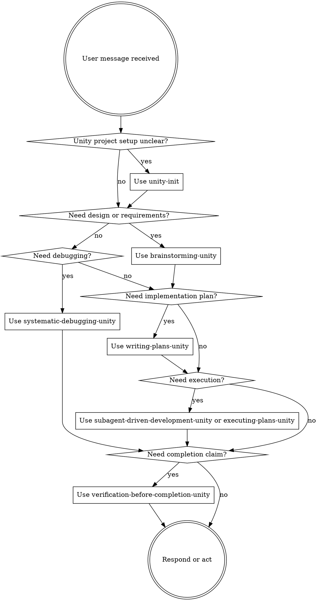

<SUBAGENT-STOP>
If you were dispatched as a subagent to execute a specific task, skip this skill unless your prompt explicitly asks you to use it.
</SUBAGENT-STOP>

<EXTREMELY-IMPORTANT>
If there is even a 1% chance a Unity Superpowers skill might apply, invoke or load the relevant skill before responding, asking clarifying questions, editing files, or running tools.

If a Unity Superpowers skill applies, you do not have discretion to skip it.
</EXTREMELY-IMPORTANT>

## Instruction Priority

Unity Superpowers skills guide workflow, but user and project instructions remain higher priority:

1. **User's explicit instructions**: direct requests, `AGENTS.md`, `CLAUDE.md`, `GEMINI.md`, and project rules.
2. **Unity Superpowers skills**: workflow rules for Unity planning, debugging, implementation, review, and verification.
3. **Default agent behavior**: general model behavior and habits.

If a project instruction conflicts with a skill, follow the user or project instruction and report the conflict when it affects quality or verification.

## Why This Skill May Not Appear

`using-superpowers-unity` appears only after the Unity Superpowers package is installed into the active agent's skill location and the agent refreshes its skill index.

For Codex project-local use, verify:

```text
<UnityProject>/.agents/skills/using-superpowers-unity/SKILL.md
```

If that file is missing, the package was not installed into the active project. If the file exists but the skill still does not appear, start a new Codex session or refresh the agent so project-local skills are reloaded.

The package repository itself is not enough. Skills must be copied or installed into the location the current coding agent reads.

## Unity Session Startup

For Unity tasks, check for:

- Unity project markers: `Assets/`, `Packages/manifest.json`, `ProjectSettings/ProjectVersion.txt`
- project instruction files: `AGENTS.md`, `CLAUDE.md`, `GEMINI.md`
- project-local Unity Superpowers skills
- `docs/solutions/` knowledge store
- MCPForUnity availability and target identity when Editor work is expected

If `docs/solutions/` exists, do a targeted search before design, planning, debugging, subagent prompting, or verification. Search by current feature, Unity subsystem, scene, prefab, package, error message, MCP tool, or test mode. Do not bulk-read the whole knowledge store.

## How to Access Skills

Use the current agent's skill activation mechanism:

- **Codex**: use skills listed in the session. Project-local skills usually require `.agents/skills/` plus a fresh session or refresh.
- **Claude Code**: use the `Skill` tool. Never manually read skill files during normal work when the skill tool is available.
- **Gemini CLI**: use `activate_skill` after the package has been installed into the location Gemini reads.
- **Other agents**: use the platform's documented skill or instruction loading mechanism.

If the requested Unity Superpowers skill is not listed, inspect installation first. Do not silently fall back to the original generic Superpowers skill for Unity work.

## Platform Adaptation

Some inherited skill text uses Claude Code tool names. Non-Claude platforms should map tool names through:

- `references/codex-tools.md`
- `references/copilot-tools.md`
- `references/gemini-tools.md`

The workflow discipline stays the same; only tool names and invocation mechanics change.

# Using Skills

## The Rule

Invoke relevant or requested Unity Superpowers skills before any response or action. Even a 1% chance that a skill applies means you should load it and check. If it turns out to be irrelevant, say so briefly and continue.



## Red Flags

These thoughts mean STOP: you are rationalizing:

| Thought | Reality |
|---------|---------|
| "This is just a simple question" | Questions are tasks. Check for skills. |
| "I need more context first" | Skill check comes before clarifying questions. |
| "Let me explore the project first" | Skills tell you how to explore. Check first. |
| "I can inspect files quickly" | Files lack workflow context. Check for skills. |
| "The generic Superpowers skill is close enough" | Unity work should use the Unity-specific skill. |
| "I remember this skill" | Skills evolve. Load the current version. |
| "The skill is overkill" | Simple Unity changes often touch serialized state, scenes, prefabs, or verification. |
| "I'll just do this one thing first" | Check before doing anything. |
| "I know what that means" | Knowing the concept is not the same as using the skill. |

## Skill Priority

When multiple skills could apply, use this order:

1. **Project readiness**: `unity-init`
2. **Process skills**: `brainstorming-unity`, `systematic-debugging-unity`
3. **Planning and execution**: `writing-plans-unity`, `subagent-driven-development-unity`, `executing-plans-unity`
4. **Engineering discipline**: `test-driven-development-unity`, `requesting-code-review-unity`, `receiving-code-review-unity`
5. **Evidence and capture**: `verification-before-completion-unity`, `compound-unity`, `finishing-a-development-branch-unity`

Examples:

- "Let's build X" -> `brainstorming-unity`, then `writing-plans-unity`.
- "Fix this bug" -> `systematic-debugging-unity`, then `test-driven-development-unity` if code changes are needed.
- "Set up this Unity project" -> `unity-init`.
- "Review the existing spec/implementation plan and decide next step" -> `writing-plans-unity` existing plan review handoff.
- "Implement this approved plan" -> `subagent-driven-development-unity` when subagents are available, otherwise `executing-plans-unity`.
- "Is this done?" -> `verification-before-completion-unity`.

Handoff expectations:

- After `brainstorming-unity` writes the spec, ask whether to proceed to `writing-plans-unity`.
- After `writing-plans-unity` writes the plan, ask whether to run `using-git-worktrees-unity` and then execute with `subagent-driven-development-unity` or `executing-plans-unity`.
- After reviewing an existing implementation plan, do not stop at analysis. If execution-ready, offer `Worktree + Subagent-Driven` and `Worktree + Inline Execution`. If not execution-ready, offer plan correction, baseline isolation, or stop.
- Before any plan execution, `using-git-worktrees-unity` must set up or verify isolation, unless the user explicitly approves working in place.

## Skill Types

**Rigid**: `test-driven-development-unity`, `systematic-debugging-unity`, `verification-before-completion-unity`. Follow exactly.

**Flexible**: planning, review, compound capture, and worktree skills. Adapt to project constraints, but keep the required checkpoints.

## User Instructions

Instructions say what the user wants. Skills guide how to do it. "Add X" or "Fix Y" does not mean skipping Unity setup checks, architecture choices, tests, code review, or verification evidence.
